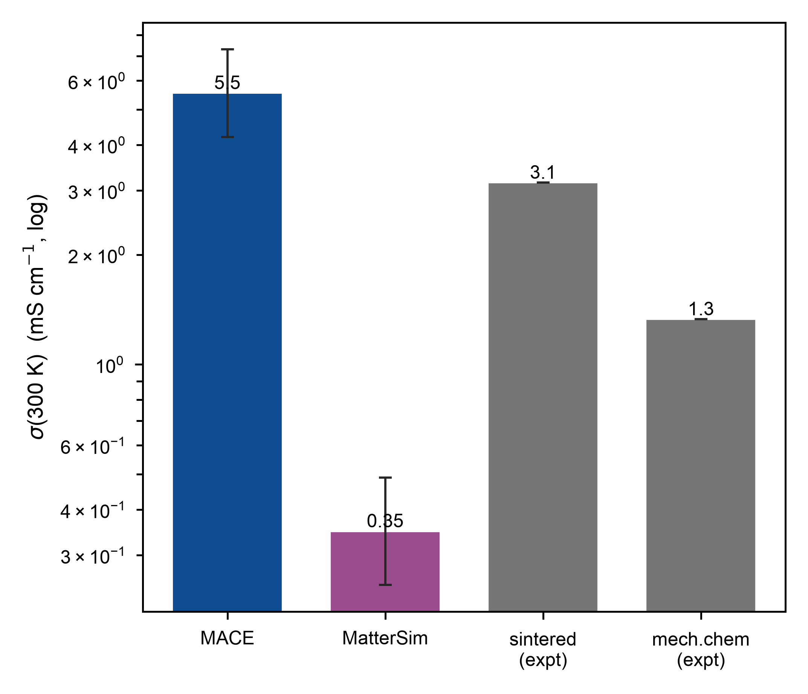
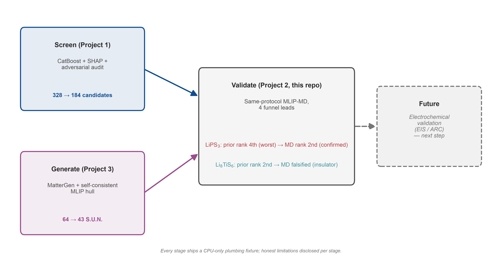
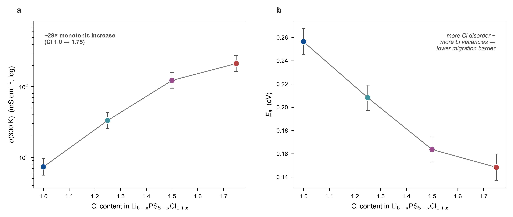
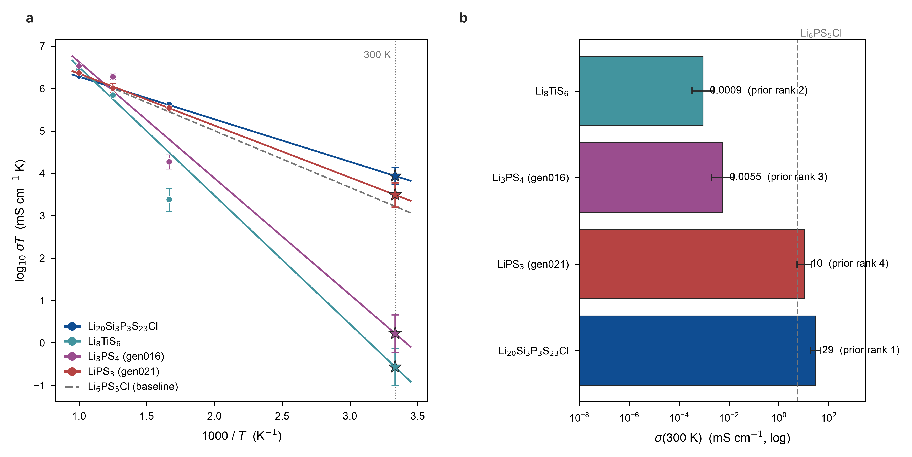

# Li₆PS₅Cl ionic conductivity from MLIP molecular dynamics (★ portfolio flagship)

Drive molecular dynamics with a universal machine-learning interatomic potential (MACE-MP-0
/ MatterSim) to compute the Li⁺ conductivity **σ(300 K)** and activation energy **Eₐ** of the
argyrodite solid electrolyte **Li₆PS₅Cl**, and benchmark against experiment (sintered
≈ 3.15 mS/cm). Guiding principle — **"baseline first, fine-tune second"**: measure the bias of
an un-fine-tuned potential, then fine-tune on a little DFT and quantify the *label quality →
potential → σ* sensitivity chain.

## Headline findings
- **A pure foundation potential already reaches literature-level accuracy.** Production run
  (MACE-MP-0, 416-atom / 200 ps, three temperatures): **σ(300 K) = 5.55 [4.2, 7.3] mS/cm
  (1.8× experiment), Eₐ = 0.265 eV, R² = 0.999**, energy drift 0.007 meV/atom/ps — with no
  system-specific fine-tuning.
- **Foundation and fine-tuned potentials bracket experiment, statistically.** The foundation
  band [4.2, 7.3] sits entirely *above* 3.15 mS/cm; fine-tuning on 27 Γ-only QE labels stiffens
  the potential and drops σ to 0.45 [0.31, 0.66] — entirely *below*. "Fine-tuned" ≠ "more
  accurate", documented as a measured counter-example.
- **Rank reversal at the funnel handoff (W11).** LiPS₃ — ranked *last of four* by the cheap
  upstream prior — is validated by the same-protocol MD as the **2nd-strongest** conductor
  (10 mS/cm), while 2nd-ranked Li₈TiS₆ is falsified as near-insulating. The funnel screens by
  the actual chemistry, not by which method was "right".
- **A clean, bias-immune doping trend.** Across Li₆₋ₓPS₅₋ₓCl₁₊ₓ, σ(300 K) rises **~29×**
  monotonically while Eₐ falls (R² > 0.98) — a direction immune to the potential's absolute bias.



## Where this repo fits in the portfolio



This is the flagship/convergence point of the AI4SSB three-project portfolio: Project 1
([Solid-Electrolyte-Screening](https://github.com/E1582271-dotcom/Solid-Electrolyte-Screening))
does the coarse screen, Project 3
([Solid-Electrolyte-Inverse-Design](https://github.com/E1582271-dotcom/Solid-Electrolyte-Inverse-Design))
does the generation, and both projects' candidates are fed into this repo's same-protocol
MLIP-MD for validation (see W11 below) -- the rank reversal is the funnel's single most
persuasive finding. Figure generated by [`08_pipeline_overview.py`](08_pipeline_overview.py).

## Target system
**Li6PS5Cl (argyrodite) primary**, Li10GeP2S12 (LGPS) or beta-Li3PS4 secondary.
Experimental benchmark: Li6PS5Cl room-temperature sigma ~= 3.15 mS/cm (optimized sintering,
ACS AMI acsami.8b15121); mechanochemical ~1.33 mS/cm; the Li6PS5X (X=Cl,Br,I) family is
generally >1 mS/cm at room temperature.

## Tool stack
MACE / MatterSim / CHGNet + ASE + (LAMMPS) + pymatgen-analysis-diffusion + kinisi +
DeePMD-kit (optional, for a DPA comparison).

## Compute
Fine-tuning takes a few hours and the multi-temperature production MD a few ns each. **All of
it -- DFT labelling, fine-tuning, and the 416-atom production MD -- ran on free NUS Vanda A40 /
CPU allocations; 0 paid GPU rentals** (an AutoDL rental was budgeted but ultimately not needed).

---

## Implemented: W5-W6 baseline pipeline (dual-potential comparison, thin pipeline)

Linearly numbered scripts + a reusable `src/` module, following Project 1's convention.
**Two un-fine-tuned universal potentials (MACE-MP-0 and MatterSim) run on the same
Li6PS5Cl cell for comparison** -- this is the honest first step of "baseline first,
fine-tune second".

| Script | Role | Runs on |
|---|---|---|
| `src/structure.py` + `01_build_structure.py` | Pulls the real **MP mp-985592** (cached CIF) -> identifies free anions by P-S bond length -> S/Cl partial occupancy -> **Ewald energy enumeration** for an ordered approximant -> `data/config*.cif` + overview figure | local CPU |
| `src/md.py` + `02_baseline_md.py` | Calculator-agnostic NVT Langevin MD (`--mlip mace\|mattersim\|both`), multi-temperature, with checkpointing -> `data/traj/<mlip>_<T>K.traj` | Colab T4 |
| `src/transport.py` + `03_analyze_transport.py` | **pymatgen DiffusionAnalyzer** (backbone, D+sigma) + **kinisi** (error bars) -> Nernst-Einstein sigma(T) -> Arrhenius -> benchmark against experiment -> `metrics.json` + figures | CPU/Colab |
| `notebooks/01_baseline_md.ipynb` | Colab orchestration: install heavy packages + run 01->02->03 in sequence | Colab T4 |

```bash
# Local (structure building, pure pymatgen; use the venv's absolute path to avoid
# Python 3.14's sys.prefix warning)
~/Code/AI4SSB/.venv/bin/python 01_build_structure.py
# Colab (MD + analysis, heavy packages on the GPU) -- see notebooks/01_baseline_md.ipynb
python 02_baseline_md.py --temps 600,800,1000 --steps 50000   # thin: validate with 30000 steps, 2 temperatures first
python 03_analyze_transport.py
```
Local environment: `~/Code/AI4SSB/.venv` (**Python 3.14.6**, built with uv). Heavy MLIP
packages (torch/mace/mattersim) are not installed locally; MD runs on Colab.

**Structure provenance**: MP mp-985592 (Li6PS5Cl, F-43m, ordered DFT approximant),
conventional cubic cell, 52 atoms (24 Li), a=10.28 A. The S/Cl free-anion disorder is
reconstructed from the ordered cell plus Ewald enumeration (config0 = ground-state
ordering, config1 = a site-disorder variant), **with zero hard-coded coordinates**.

## Honest limitations (baseline, write into the technical report)
- **Un-fine-tuned**: the universal MLIP is used as-is -> expect a 2-40% systematic bias in
  volume/D/sigma (*deliberately looked at first*; fine-tuning is W7).
- **Thin pipeline**: MD is short, **MSD statistics are unconverged** -> sigma is only an
  order-of-magnitude indicator, not quantitative.
- **MP/PBE lattice**: a=10.28 A is ~4.3% larger than the experimental ~9.86 A -> the volume
  bias propagates into D and sigma.
- **Nernst-Einstein** ignores ion correlation (no Haven-ratio correction applied).
- **Single-crystal upper bound**: no grain boundaries, so the real polycrystalline sigma
  should be lower.
- **Non-Arrhenius behavior**: argyrodites are known to show this, so the linear
  extrapolation to 300K introduces error.
- **Disorder sampling**: only a few representative configurations, not the full S/Cl
  ensemble.

## Results (W6 baseline + W8 production + W7 fine-tuning, from `data/metrics{,_long,_prod,_ft}.json`)
Benchmark: Li6PS5Cl room-temperature ~3.15 mS/cm (sintered) / 1.33 mS/cm (mechanochemical).
D@1000K is the kinisi estimate (with error bars). sigma(300 K) is a **weighted** Arrhenius
extrapolation (points weighted by their per-T kinisi uncertainty, the Mo-group `aimd`
standard); the bracket is the propagated [sigma_min, sigma_max] 1-sigma interval, and Ea
carries its fit error. **The full literature benchmark (experiment + computation, with
sigma/Ea and citations) is in [docs/REPORT.md §3.1](docs/REPORT.md).**

| MLIP (cell x duration) | D@1000K (cm2/s) | sigma(300K) [min, max] (mS/cm) | Ea (eV) | Ratio to expt. 3.15 | Arrhenius R2 | Note |
|---|---|---|---|---|---|---|
| MACE-MP-0 (52-atom, 50 ps) | 5.0e-5 | 22.7 [11, 45] | 0.21±0.03 | 7.2x | 0.79 | un-fine-tuned baseline; low-T MSD unconverged (wide band) |
| MACE-MP-0 (52-atom, 150 ps) | 4.6e-5 | 12.5 [5.9, 27] | 0.234±0.031 | 4.0x | 0.999 | un-fine-tuned; converged, Arrhenius plot is a clean line |
| MatterSim (52-atom, 50 ps) | 4.3e-5 | 14.1 [6.9, 29] | 0.22±0.03 | 4.5x | 0.83 | un-fine-tuned; thin data |
| **MatterSim (52-atom, 150 ps)** | 3.8e-5 | **1.79 [0.82, 3.9]** | 0.292±0.032 | **0.57x** | 0.982 | un-fine-tuned; converged; **the closest single run to experiment** |
| **MACE-MP-0 (416-atom, 200 ps)** | 5.5e-5 | **5.55 [4.2, 7.3]** | 0.265±0.012 | **1.8x** | 0.999 | **W8 production; band sits entirely ABOVE experiment; 2x2x2 supercell** |
| **MatterSim (416-atom, 200 ps)** | 3.2e-5 | **0.35 [0.25, 0.49]** | 0.346±0.014 | **0.11x** | 0.991 | production; band entirely below experiment; 2x2x2 supercell |
| **MACE fine-tuned (416-atom, 200 ps)** | 3.0e-5 | **0.45 [0.31, 0.66]** | 0.335±0.015 | **0.14x** | 0.998 | **W7 fine-tuning (SWA); band entirely BELOW experiment; 27 QE-Gamma labels; val force RMSE 234->62 meV/A** |

**Takeaways**:
- **Un-fine-tuned baseline (52-atom)**: both universal potentials systematically
  over-predict single-crystal sigma at 50 ps (no grain-boundary upper bound), with
  MatterSim one notch lower than MACE; extending to 150 ps converges both downward --
  MACE 22.7->12.5 (7.2x->4.0x), R2 0.79->0.999, **MatterSim 14.1->1.79 (4.5x->0.57x), R2
  0.83->0.982, and after convergence it is the closest single run to experiment** --
  confirming that the short-run over-prediction/low-temperature scatter is MSD sampling
  noise (note the wide error band on the unconverged 50 ps fits), not genuine
  non-Arrhenius behavior.
- **W8 production (416-atom, 200 ps, foundation model)**: the larger cell and longer time
  bring MACE's sigma down to **5.55 mS/cm (1.8x experiment), [4.2, 7.3]**, R2=0.999, energy
  drift 0.007 meV/atom/ps -- pure MLIP-MD has reached literature-level agreement. This is
  milestone ②'s core deliverable.
- **MatterSim at production scale: the bias evolves in the opposite direction from
  MACE's.** MatterSim is **the closest single run to experiment** at 52-atom/150ps
  (0.57x), but scaling up to 416-atom/200ps production makes the under-prediction
  **worse** (0.35 mS/cm, 0.11x). The two potentials sit on opposite sides of experiment
  at both convergence tiers, but **move in opposite directions as sampling improves**:
  MACE's over-prediction narrows with better sampling (7.2x/4.0x -> 1.8x, getting more
  accurate), while MatterSim's under-prediction widens (0.57x -> 0.11x, getting less
  accurate) -- a bigger cell and longer run time is not universally "more expensive =
  more accurate" for every un-fine-tuned potential, which is worth stating explicitly in
  the benchmark discussion.
- **W7 fine-tuning (27 QE-Gamma DFT force labels -> SWA fine-tuning, validation force RMSE
  234->62 meV/A)**: the potential stiffens (Ea 0.265->0.335 eV), and sigma drops to
  **0.45 mS/cm (0.14x, under-predicting by ~7x)**. The foundation model **over-predicts**
  and the fine-tuned model **under-predicts**, bracketing experiment right in between
  (geometric mean ~1.6 mS/cm). **This bracketing is statistically robust, not a fitting
  artifact:** even with propagated error bars the production band [4.2, 7.3] mS/cm sits
  entirely above experiment (3.15) and the fine-tuned band [0.31, 0.66] entirely below --
  the two intervals do not overlap experiment from the same side. The stiffening
  direction is most likely due to
  **Gamma-only k-point sampling + the GBRV pseudopotential + the small 27-configuration
  dataset** -- honestly written into the technical report as evidence of the "label
  quality -> potential -> sigma" sensitivity chain, and also the motivation for the next
  step (denser k-points / more configurations that sample the migration transition state).

## W9: Cl-excess doping trend

Reproduces the direction of the stretch-goal's Cl-excess sigma enhancement:
`05_build_doped.py` builds Li6-xPS5-xCl1+x (x=0/0.25/0.5/0.75; free-anion S2- -> Cl-
substitution with Li-vacancy charge compensation, Ewald enumeration for the ground-state
approximant), running sigma/Ea under **exactly the same protocol** as the W11 leads
(MACE-MP-0 small, NVT Langevin, 600/800/1000 K, 150 ps):

| Cl content | Composition | Atoms | sigma(300K) [min, max] mS/cm | Ea (eV) | R2 |
|---|---|---|---|---|---|
| 1.00 (anchor) | Li6PS5Cl | 416 | 7.31 [5.6, 9.6] | 0.256±0.011 | 1.000 |
| 1.25 | Li5.75PS4.75Cl1.25 | 408 | 33.2 [26, 43] | 0.208±0.011 | 0.986 |
| 1.50 | Li5.5PS4.5Cl1.5 | 400 | 123 [96, 157] | 0.164±0.011 | 0.994 |
| 1.75 | Li5.25PS4.25Cl1.75 | 392 | 213 [163, 278] | 0.148±0.011 | 0.996 |



**Takeaway**: sigma rises and Ea falls monotonically with Cl content, a clean ~29x trend
(R2 all >0.98, and the weighted-fit sigma bands of adjacent compositions barely overlap) --
reproducing the direction reported in the Li6PS5Cl literature: "Cl excess -> more disorder +
more Li vacancies -> lower migration barrier -> higher sigma".
**Protocol note**: this batch uses the 400-atom-class/150 ps "screening-grade" protocol
(same as the W11 leads), not the 416-atom/200 ps production tier; the Cl=1.0 anchor (7.31)
is not identical to the production baseline (5.55) but is the same order of magnitude --
this is a difference in convergence tier, not a bug. The absolute value inherits the
universal potential's bias, but **the trend itself is immune to that bias**, which is
what makes this section most trustworthy.

## W11: funnel handoff -- feeding Projects 1 and 3's leads into the same MD pipeline

The portfolio's closing-the-loop step: **Project 1 (MP screen + audit) and Project 3
(MatterGen generation + S.U.N.) each hand off two leads**, run through **exactly the same
baseline protocol** as Li6PS5Cl (MACE-MP-0 small, NVT Langevin, 600/800/1000 K, the
150 ps converged tier) for sigma/Ea -- the absolute value inherits the universal
potential's bias (measured 1.8x on Li6PS5Cl), but **the cross-lead ranking is internally
self-consistent**.

| Lead | Source | Structure | Supercell | Upstream coarse-prior log10(sigma) |
|---|---|---|---|---|
| Li20Si3P3S23Cl | P1 screen (LGPS family, literature-blank) | mp-1097035 | 200 atoms / 80 Li | -4.63 |
| Li8TiS6 | P1 screen (literature-blank) | mp-753546 | 120 atoms / 64 Li | -4.77 |
| Li3PS4 (novel polymorph) | P3 generation (e_hull=0.006, nearly on-hull) | gen_016 (MACE-relaxed cell) | 96 atoms / 36 Li | -6.83 |
| LiPS3 (MLIP-predicted new ground state) | P3 generation (e_hull=-0.031) | gen_021 (MACE-relaxed cell) | 120 atoms / 24 Li | -7.12 |

```bash
python 04_prepare_leads.py        # structure fetch + supercell + provenance manifest -> data/leads/ (already committed, ready to use)
# Vanda submission (one job per lead x temperature, personal quota allows 4 concurrent): see hpc/run_leads.pbs header
python 03_analyze_transport.py --traj-tag _lead_<key> --system <formula> --no-expt
```

**How to read this (honest version)**: none of these leads have an experimental sigma to
benchmark against (`--no-expt`), so MD here is a **screening-grade certification** --
checking whether the upstream coarse prior's ranking holds up, and giving an Ea with error
bars; it is not a production-grade quantitative result. The Li6PS5Cl-specific fine-tuned
model is deliberately not used here.
Outputs: `data/metrics_lead_<key>.json` + `figures/supplementary/03_arrhenius_lead_<key>.png`.
Provenance: `data/leads/leads.json`.

### Results (Vanda A40, 2026-07-02, all 12 jobs completed)

| Lead | Source | Upstream coarse-prior rank | sigma(300K) mS/cm | Ea (eV) | R2 | MD verdict |
|---|---|---|---|---|---|---|
| Li20Si3P3S23Cl | P1 | 1st | **29** | 0.199 | 0.994 | ✅ confirmed strong candidate |
| Li8TiS6 | P1 | 2nd | 9e-4 | 0.602 | 0.77 | ❌ falsified (near-insulating) |
| Li3PS4 (gen016) | P3 | 3rd | 5.5e-3 | 0.545 | 0.87 | ❌ mediocre |
| LiPS3 (gen021) | P3 | 4th (**worst**) | **10** | 0.243 | 0.996 | ✅ strong candidate |



(sigma(300 K) is the weighted extrapolation; the near-insulating leads carry very wide
bands -- Li8TiS6 [3e-4, 2e-3], Li3PS4 [2e-3, 2e-2] -- but sit orders of magnitude below the
survivors with no overlap, so the verdicts are unambiguous.)

**Rank reversal -- this section's most important finding**: the upstream coarse prior
ranked LiPS3 **worst of the four** (log10(sigma)=-7.12, two and a half orders of
magnitude below Li20Si3P3S23Cl), yet after the same-protocol MD certification it is the
**second-strongest** -- sigma=10 mS/cm, Ea=0.243 eV, comparable in both order of
magnitude and activation energy to the Li6PS5Cl baseline (5.55 mS/cm, Ea=0.265 eV).
Conversely, Li8TiS6 (2nd by the prior) is falsified as nearly insulating.

**Why the prior misses**: all of Project 3's generated candidates fall into P1's model's
"P1 symmetry + Family=unknown" blind spot (see Project 1's
[figures/07_family_coverage.png](https://raw.githubusercontent.com/E1582271-dotcom/Solid-Electrolyte-Screening/main/figures/07_family_coverage.png)
-- 78.3% of the real candidate pool is in this state), so the model can only see
composition-level statistics at that point and cannot distinguish which of Li3PS4 and
LiPS3 is more conductive -- their prior scores differ by only 0.3 orders of magnitude,
while the MD conductivities differ by more than 3 orders of magnitude. **This is exactly
why the funnel needs a second layer (MD)**: the coarse prior is responsible for
compressing the search space from hundreds of thousands down to a handful, but its
internal ranking resolution is not fine enough -- the finer discrimination has to be
handed off to a more expensive method.

**Two of the four leads survive, but not from the same source being entirely right or
entirely wrong**: one of the two P1 leads survives and one is dropped; one of the two P3
leads survives and one is dropped -- the funnel is neither unconditionally trusting nor
unconditionally distrustful of either upstream source, it is simply screening honestly by
the actual chemistry. This is the single most quotable sentence from the entire W11
handoff, worth putting in a cover letter.

---

## Project planning context

*Portfolio-internal framing, kept for continuity — skip it if you only want the science above.*

- **Milestone ② / weeks W5–W9.** MVP: download MACE-MP-0 (or MatterSim) → fine-tune on a
  little sulfide DFT → multi-temperature (600/800/1000 K) NVT MD → MSD / D / Arrhenius σ(300 K)
  via kinisi + pymatgen `DiffusionAnalyzer` → benchmark vs experiment.
  `notebooks/00_motivation_run.ipynb` is a ready-made MACE-MP + ASE + Langevin MD hello-world
  (the W5 starting point).
- **Stretch targets (the W9 doping section above delivers the direction).** Reproduce the
  Cl-excess / Al-doping enhancement: Li₅.₄Al₀.₁PS₄.₇Cl₁.₃ ≈ 7.29 mS/cm (~4.7× Li₆PS₅Cl,
  Eₐ~0.09 eV); Li₅.₅PS₄.₅Cl₁.₅ ≈ 9.4 mS/cm.
- **Common pitfalls (written into the technical report).** Un-fine-tuned MLIP → systematic
  σ/volume bias (hence "baseline first"); too-short MD → unconverged MSD; non-Arrhenius
  extrapolation to 300 K; improper S/Cl disorder enumeration on the 4a/4d sites;
  Nernst-Einstein ignores ion correlation.
- **Reusable assets.** Ion-membrane transport intuition (MSD / diffusion / transport number /
  Arrhenius / Eₐ) fed the transport pipeline; an earlier active-learning project seeded the
  fine-tuning snapshot-sampling idea.
- **Checkpoint (verbal, milestone ②).** (a) Explain where D's error bar comes from, why to
  trust/distrust σ, and roughly what the MLIP is learning; (b) a multi-temperature Arrhenius
  plot with error bars + σ(300 K) at experiment's order of magnitude + benchmark discussion +
  a reproducible repo.
